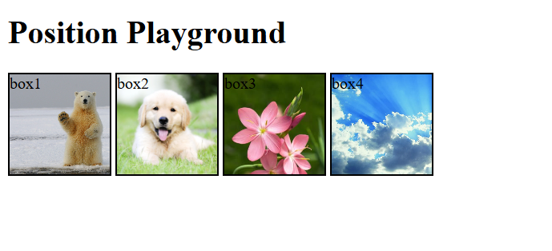
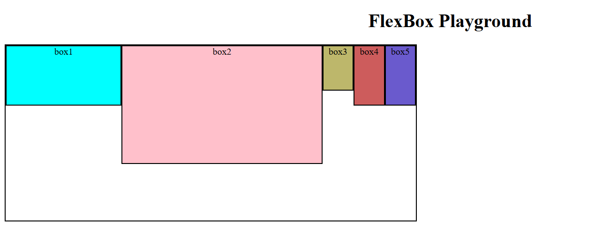
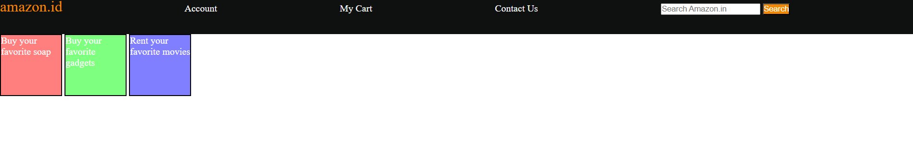
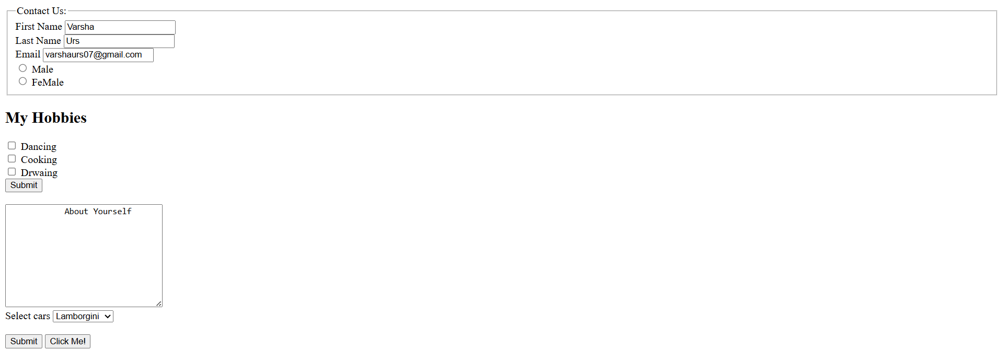
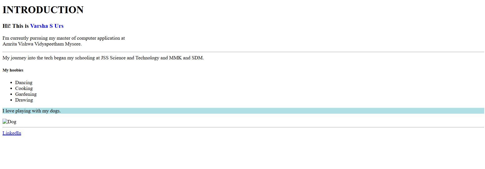
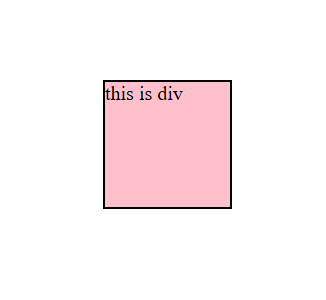
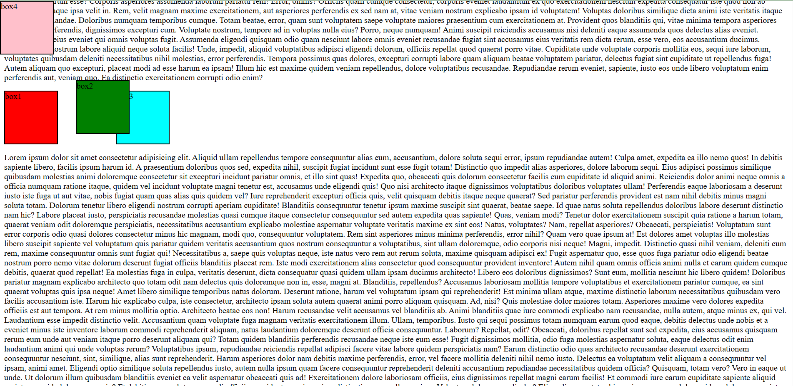
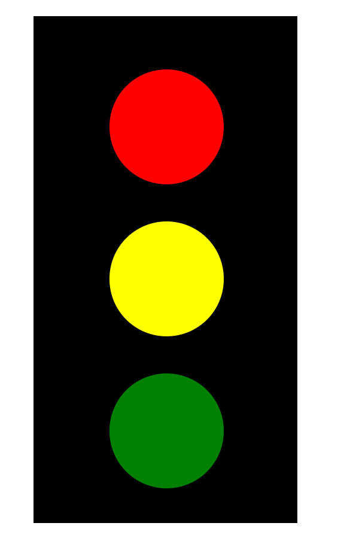

# html-css-practice
A collection of beginner to intermediate level projects created using only HTML and CSS. This repository is aimed at improving front-end design skills through hands-on practice.

## 🔥 Features

- Pure HTML & CSS based practice projects
- Covers various layouts, components, and UI patterns
- Great for beginners to strengthen frontend basics
- Organized by project folders with individual `index.html` and `style.css`

## 📸 Project Output Screenshots

> Below are the outputs of various HTML & CSS practice tasks stored in the `assets/` folder.

### 🖼️ Background Demo

### 🧱 Flexbox Layout

### 🧩 Header Section

### 📜 Footer Section

### 📝 Form Design

### 👋 Introduction Page

### 🎞️ Keyframe Animation

### 🔗 Navigation Bar

### 🎯 Positioning Example

### 📅 Timetable Layout

### 🚦 Traffic Signal Using CSS

